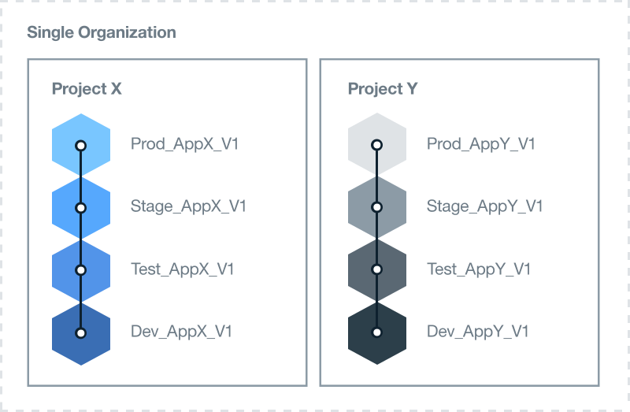

---

copyright:

  years: 2015, 2017
lastupdated: "2017-08-30"

---

{:new_window: target="_blank"}
{:shortdesc: .shortdesc}
{:screen:.screen}
{:codeblock:.codeblock}

# 設定 Bluemix 環境
{: #patterns}

一個成功的專案，需要花時間計劃和設計您需要哪些資源，以及您的企業需求為何。為了協助您開始進行雲端專案，請考量下列問題：

* 將要開發的應用程式數量及類型？
* 應用程式需要存取哪些服務？
* 哪些人會在開發過程中分工合作，以及他們將扮演什麼角色？
* 專案的每一個階段所需的隔離程度為何？
* 您的企業是否會提供基礎架構資源？
* 貴公司的通訊方式？
* 是否有可以實作的命名標準，以清楚識別組織和空間用量？   

{:shortdesc}

設計雲端解決方案時，也請思考帳戶安全，以及作業需求、國家/地區法規、市場指引和公司政策。為了滿足您的專案需求，{{site.data.keyword.Bluemix}} 提供三種類型的雲端環境。

* [{{site.data.keyword.Bluemix_notm}} 公用](/docs/overview/whatisbluemix.html "{{site.data.keyword.Bluemix_notm}} 公用")：由不同的公司及使用者共用的基礎架構資源。
* [{{site.data.keyword.Bluemix_notm}} 專用](/docs/dedicated/index.html#dedicated "{{site.data.keyword.Bluemix_notm}} 專用")：您使用自己專用的 {{site.data.keyword.BluSoftlayer_notm}}，可以將其安全地連接至「{{site.data.keyword.Bluemix_notm}} 公用」雲端和您自己的網路。
* [{{site.data.keyword.Bluemix_notm}} 本端](/docs/local/index.html#local "{{site.data.keyword.Bluemix_notm}} 本端")：位於公司防火牆後面，可保護您最機密的工作負載，並可安全地連接至「{{site.data.keyword.Bluemix_notm}} 公用」和「{{site.data.keyword.Bluemix_notm}} 專用」雲端。

在決定您需要哪種類型的雲端環境時，就要計劃帳戶、組織、空間、資源和團隊成員的結構。

對大部分公司而言，單一 {{site.data.keyword.Bluemix_notm}} 帳戶即已足夠。如果是有多個業務領域的較大型公司，您可以針對每一個業務領域設定個別的 {{site.data.keyword.Bluemix_notm}} 帳戶。例如，在大型的銀行金融公司中，對於零售和商業部門，可能會有個別的帳戶。

下表提供部分重要元素的摘要。

| 元素| 說明
|
|---------------------------------------|--------------------------------------------------------------------------------------|
| 帳戶| 每一個帳戶各有一個帳戶擁有者。|
|| 包含一個以上的組織。您必須有「隨收隨付制」帳戶，才能建立多個組織。|
| 帳戶擁有者| 負責帳戶內累計的所有使用費用。|
|| 只能擁有一個帳戶。|
|| 可以新增一個以上的組織管理員來委派組織管理作業，其中包括組織的讀取和寫入權。|
|| 可以是其他 {{site.data.keyword.Bluemix_notm}} 帳戶之組織和空間中的團隊成員。|
| 組織| 包含一個以上的空間。|
|| 包含一個以上的組織管理員。|
|| 包含一個以上的團隊成員。每一個團隊成員可以被授與一個以上的角色。|
|| 使用費用（由部署在空間中的應用程式所產生）是在組織層次提報。|
| 空間| 包含一個以上的資源。|
|| 包含一個以上的應用程式。|
|| 包含一個以上的空間管理員。|
|| 包含一個以上的團隊成員。每一個使用者都必須已經是擁有組織中的團隊成員。每一個團隊成員可以被授與一個以上的角色。|
| 團隊成員| 可以新增至不同帳戶的一個以上組織和空間中。|
|| 可以在相同的組織及/或空間內被賦予多個角色。|
{:caption="表 1. 重要元素的說明" caption-side="top"}

## 決定您的 {{site.data.keyword.Bluemix_notm}} 環境
{: #bpimplementation}

您可以實作讓開發人員和測試人員能夠與其他團隊成員分工合作的環境，而不是傳統嚴格定義的開發、測試和正式作業方法。在設計您要用來開發及交付應用程式的方法時，您可以建立 {{site.data.keyword.Bluemix_notm}} 空間來實踐該方法。您可以考慮從空間層次逐層向上設計 {{site.data.keyword.Bluemix_notm}} 環境，而不是從組織層次逐層向下設計環境。

考量您計劃要開發及部署之應用程式的規模和範圍。{{site.data.keyword.Bluemix_notm}} 空間可以用來作為緊密連接或定義的一個以上應用程式的開發環境。例如，除了開發空間之外，您可能還想要建立用於單元測試、效能測試和整合測試的空間。您也可以為建置、編譯打包和正式作業定義空間。您建立的每一個空間都可以與相同組織內的不同團隊成員共用。

若您有在不同業務領域工作的人員，而且他們的活動不會重疊，則可以建立個別的 {{site.data.keyword.Bluemix_notm}} 組織。如果有兩個完全獨立的群組，則針對每一個群組各建立一個組織，可以為團隊成員和資源的交付和管理定義清楚的界限。您可以定義 API，以在組織之間進行通訊。  

您可以配合您工作的方式來建立 {{site.data.keyword.Bluemix_notm}} 組織，而不是配合公司的內部結構。一般而言，公司組織會變動，但無論如何，應用程式的開發及維護都會繼續。請針對應用程式的生命期限來設計您的 {{site.data.keyword.Bluemix_notm}} 環境，而不是依照公司組織結構來設計。

反覆運算式開發和部署可能會導致應用程式迅速擴充。您的交付程序設計必須能夠快速並輕鬆地擴增。您會想要以快速的部署速度持續開發。讓您的開發和正式作業空間在相同的 {{site.data.keyword.Bluemix_notm}} 組織中，可提供對相同資源的存取權。在單一組織內管理不同的空間，可以減少管理負擔。如果開發、測試和作業人員在相同的 {{site.data.keyword.Bluemix_notm}} 組織內工作，就可以輕鬆地分工合作。

實作命名標準，以清楚識別組織和空間用量。例如，您可以包含雲端類型、地理區域、用量類型（如開發、測試、正式作業）、應用程式名稱，以及版本或修訂號碼。如此就可以輕鬆地識別組織和空間，以方便管理及存取。  

空間數會因為反覆運算式開發而快速倍增。您可以在組織內定義所需的空間數。如果您計劃要定義大量空間數，您可能會想要建立應用程式來協助管理空間。當空間數超過 60 時，您可能會想要考慮再定義另一個組織。

請某位人員來建立及管理組織、定義空間，以及授與團隊成員存取權。可以將相同的存取權授與第二位人員，在組織管理員沒有空時便能維護環境。  

識別需要存取各空間和組織的所有人員。決定他們的角色。團隊成員的工作角色將決定其權限。例如，資深開發人員需要檢視及更新整個 {{site.data.keyword.Bluemix_notm}} 開發環境的權限。不過，對於資淺的開發人員，其可以檢視及更新的內容將會受限。

## 決定您的組織架構
{: #orgstructure}

若要設計使用「{{site.data.keyword.Bluemix_notm}} 公用」、「{{site.data.keyword.Bluemix_notm}} 專用」、「{{site.data.keyword.Bluemix_notm}} 本端」或任何組合的雲端環境，您可以使用下列組織架構：

* 單一組織：如果您需要同一組使用者存取組織中任何地方的可用資源，無論是在「{{site.data.keyword.Bluemix_notm}} 公用」、「{{site.data.keyword.Bluemix_notm}} 專用」或「{{site.data.keyword.Bluemix_notm}} 本端」中，可以考慮使用此架構。
* 多組織：如果您需要「{{site.data.keyword.Bluemix_notm}} 公用」、「{{site.data.keyword.Bluemix_notm}} 專用」或「{{site.data.keyword.Bluemix_notm}} 本端」中的不同環境各自獨立，可以考慮使用此架構。

### 單一組織與多組織
{: #singleormulti}

在單一組織環境中，公司的不同領域會共用基礎架構資源。而在多組織環境中，不會共用基礎架構資源。

這兩種組織架構皆支援下列原則：

* 應用程式及/或專案的界限強制執行。
* 依使用者角色授與的資源管理授權。

若要實作單一組織架構，請在「{{site.data.keyword.Bluemix_notm}} 公用」、「{{site.data.keyword.Bluemix_notm}} 專用」或「{{site.data.keyword.Bluemix_notm}} 本端」中建立帳戶，並定義一個組織。然後，您可以根據不同事業線 (LOB)、交付階段、特定專案、應用程式、使用者許可權或這些元件的組合，來定義多個空間。

若要實作多組織架構，請在「{{site.data.keyword.Bluemix_notm}} 公用」、「{{site.data.keyword.Bluemix_notm}} 專用」或「{{site.data.keyword.Bluemix_notm}} 本端」中建立帳戶。接下來，您可以定義對應於不同 LOB、交付階段、特定專案、使用者許可權或這些元件之組合的組織。然後，您可以根據公司中相同部門交付的應用程式或專案來定義多個空間。

**附註：**您必須具有計費的帳戶（例如「隨收隨付制」或「訂閱」），才能定義多個組織。

### 組織考量
{: #orgconsiderations}

當您實作單一組織架構時，組織會包括您用來開發、管理及部署雲端應用程式的所有雲端資源、服務和應用程式。在「{{site.data.keyword.Bluemix_notm}} 公用」中，組織會隔離各帳戶，而所有地區都可以使用該組織。

 

 圖 1.「{{site.data.keyword.Bluemix_notm}} 公用」、「{{site.data.keyword.Bluemix_notm}} 專用」和「{{site.data.keyword.Bluemix_notm}} 本端」的單一組織架構範例
{: #bpfigure1}

當您實作多組織架構時，組織會提供第一層的界限強制執行和抽象化，您可用來控制及定義哪些人可以執行哪些作業。您可以根據不同 LOB、交付階段、使用者角色、特定專案或這些元件的組合，來設計每一個組織。  

您需要的組織數目，取決於多個因素：

* 您在組織內管理配額及控制成本時所需的精度等級。
* 您在不同環境中必須強制執行的安全等級。例如，如果您使用容器，則可能會想要將用於開發的容器映像檔與用於正式作業的容器映像檔隔離。
* 依組織、國家/地區和產業需求而設置的組織位置。例如，您可能會想要在位於您所在地理位置（地理）特定區域中的專用雲端上，執行您的所有應用程式。

當您為雲端結構定義不同的組織時，請考量下列指引：

* 定義並強制執行命名慣例。例如，定義一個命名慣例，讓組織的名稱包括業務領域、雲端類型（「{{site.data.keyword.Bluemix_notm}} 公用」、「{{site.data.keyword.Bluemix_notm}} 本端」或「{{site.data.keyword.Bluemix_notm}} 專用」）和處理程序階段（開發、測試或正式作業）的相關資訊。對於位在「{{site.data.keyword.Bluemix_notm}} 公用」中的組織，您可能還會想要新增地區的相關資訊。
* 定義適用於組織的限制。例如，定義將在該組織中工作之團隊成員的角色。
* 識別組織的管理員。
* 識別配置給此組織的業務領域。

下列情境顯示當您定義雲端環境中的 {{site.data.keyword.Bluemix_notm}} 組織數目時，可以採用的不同方法：
* **情境 1：依商業應用程式交付來隔離使用者群組**

 說明：公司規則要求每一個 LOB 的應用程式都必須由各 LOB 的使用者來開發、管理及部署。必須強制執行安全保護措施，讓使用者只能存取與其業務部分相關的應用程式。因此，使用者會在不同的業務領域中工作，他們處理的應用程式需要存取不同的 {{site.data.keyword.Bluemix_notm}} 資源，而且沒有活動重疊。

  解決方案：您可以為每一個商業應用程式交付程序各建立一個組織。例如，為零售銀行業務建立一個組織，為投資銀行業務建立另一個組織。

  

  圖 2. 配合 LOB 交付的多組織架構範例
{: #bpfigure2}

* **情境 2：根據使用者類型（內部使用者、外部使用者）的隔離**

  說明：您的公司與不同的合作夥伴共事，而您需要在內部與外部使用者之間有清楚的界限。

  解決方案：您可以建立一個組織來交付在內部使用的應用程式。此外，您也可以為每一個外部合作夥伴各建立一個組織。

* **情境 3：依專案隔離**

  說明：您的公司舉辦黑客松 (Hackathon) 來識別新服務。  

  解決方案：您可以根據每個黑客松 (Hackathon) 各定義一個組織，並使用該組織來進行沙盤推演。在舉辦黑客松 (Hackathon) 之後，您可以將沙盤推演組織提升成為帳戶中的額外組織。

* **情境 4：依交付階段隔離使用者**

  說明：有一家公司想要讓開發、測試和正式作業使用者透過交付來分工合作，但其存取權是由使用者角色和工作經驗來控制。

  解決方案：您可以建立單一組織，並且為每一個交付階段各定義一個空間。然後，視使用者角色和工作經驗而定，授與他們完成工作以及在組織內分工合作所需的讀取和寫入權。

  

   圖 3. 配合交付階段的單一組織架構範例
{: #bpfigure3}

### 組織命名、限制和管理 
{: #orgadmin}   

請考量下列組織指引：

* 定義並強制執行命名慣例。例如，定義一個命名慣例，讓組織的名稱包括業務領域、雲端類型（「{{site.data.keyword.Bluemix_notm}} 公用」、「{{site.data.keyword.Bluemix_notm}} 本端」或「{{site.data.keyword.Bluemix_notm}} 專用」）和 IT 角色（開發、測試或正式作業）的相關資訊。對於位在「{{site.data.keyword.Bluemix_notm}} 公用」中的組織，您可能還會想要新增地區的相關資訊。您可以在建立組織名稱之後予以變更。如果組織名稱有所變更，請將變更資訊通知所有組織團隊成員。
* 定義適用於組織的限制。例如，定義每一個團隊成員的角色，以及他們在該組織中工作所需的許可權。
* 識別組織的管理員。您可能會想要將組織管理工作委派給多個人員。
* 識別配置給此組織的業務領域。在組織內每一個空間中產生的應用程式用量會累計，並且在組織層次提報。

## 決定您的空間
{: #determinespaces}

在組織內，空間可提供額外的界限強制執行和抽象化層次。

空間是組織中的保留區域，使用者可在其中開發及執行應用程式和服務。您可以在組織中建立任何數量的空間，也可以控制有權存取空間的使用者。如需詳細資料，請參閱[空間](/docs/admin/orgs_spaces.html#spaceinfo "空間")。

如果您計劃要定義大量空間數，您可能會想要建立應用程式來協助管理空間。當空間數超過 60 時，您可能會想要考慮再定義另一個組織。

### 單一組織與多組織的空間
{: #spaceconsiderations}

當您採用單一組織架構時，會依照您在組織內定義的空間來提供隔離和抽象化層次。在定義空間時，請考量下列指引：

* 定義一個用來管理服務的空間，只需要在組織中佈建及配置一次。
* 根據交付生命週期來定義空間。例如，您可以為開發中的應用程式定義一個以上的空間、為測試階段中的應用程式定義一個以上的空間，並且為正式作業中的應用程式定義一個以上的空間。
* 如果足夠生命週期界限不足，您可以為每個 LOB 和足夠階段各定義一個以上的空間，以加強隔離。
* 識別您是否需要為不同的使用者群組強制執行界限。例如，開發人員無法開發應用程式並進行測試。您需要一組不同的使用者來測試應用程式。在此情境中，您可以建立兩個空間，一個供應用程式的開發人員使用，一個供應用程式的測試人員使用。然後，授與各組使用者正確空間的存取權。

當您實作多組織架構時，可以依 LOB 及/或交付生命週期來將各組織隔離。然後，您可以根據公司中相同部門交付的應用程式或專案數目來定義多個空間。在計劃組織中的空間時，請考量下列指引：

* 定義一個用來管理服務的空間，只需要在組織中佈建及配置一次。
* 為每個應用程式、每個相關應用程式群組或一個特定專案定義一個空間。
* 如果您需要為不同的使用者強制執行界限，請為每一組使用者定義一個空間。當使用者被授與空間中的開發人員角色時，該使用者即具有完整的存取權，可以存取在該空間中佈建及執行的任何資源和 {{site.data.keyword.Bluemix_notm}} 服務。如果您需要強制執行更嚴密的安全措施，以防止使用者控制每項資源，請考慮定義不同的空間。您可以在這其中的任何空間內佈建 {{site.data.keyword.Bluemix_notm}} 服務，以供在該空間執行的應用程式使用。

### 空間命名、限制及管理  
{: #spaceadmin}

若要為雲端組織定義不同的空間，請考量下列指引：

* 定義並強制執行命名慣例。例如，定義一個命名慣例，讓空間名稱包括組織所在位置以及雲端類型（「{{site.data.keyword.Bluemix_notm}} 公用」、「{{site.data.keyword.Bluemix_notm}} 專用」或「{{site.data.keyword.Bluemix_notm}} 本端」）的相關資訊。您可以在建立空間名稱之後予以變更。如果空間名稱有所變更，請將變更資訊通知所有空間團隊成員。
* 定義適用於空間的限制。例如，定義可以在每一個空間中開發、管理及部署的應用程式類型。
* 識別空間的管理員。您可能會想要將空間管理工作委派給多個人員。

## 決定組織的配額
{: #determinequota}

當您在 {{site.data.keyword.Bluemix_notm}} 中建立組織時，會佈建基礎架構資源，其中包括例如記憶體、網際網路通訊協定 (IP)、伺服器和儲存空間等資源：
*	若為「{{site.data.keyword.Bluemix_notm}} 公用」，IBM 會配置一組最基本的資源給組織。根據帳戶類型，您會有不同的資源配置。這些資源會定義 IBM 配置給組織的配額。
*	若為「{{site.data.keyword.Bluemix_notm}} 專用」，您可以向 IBM 要求一組資源，然後將其分配給「{{site.data.keyword.Bluemix_notm}} 專用」雲端環境中的不同組織。
*	若為「{{site.data.keyword.Bluemix_notm}} 本端」，則是由您提供資源，然後將其分配給「{{site.data.keyword.Bluemix_notm}} 本端」雲端環境中的不同組織。

若為「{{site.data.keyword.Bluemix_notm}} 公用」和「{{site.data.keyword.Bluemix_notm}} 專用」，您可以向 IBM 要求額外的資源。若為「{{site.data.keyword.Bluemix_notm}} 本端」，則由您負責提供在本端雲端中營運可能需要的任何資源。

配置給組織的配額，即代表組織內可用的資源。您可以管理配額，並決定如何將資源分配至整個組織。

### 管理及監視配額
{: #managequota}

您可以依空間和依基礎架構來管理及監視帳戶的配額。佈建在空間中，然後由已部署應用程式使用的任何資源，都會耗用組織可用的一部分配額。
* 如需如何在「{{site.data.keyword.Bluemix_notm}} 公用」中檢視及管理組織配額的相關資訊，請參閱[管理配額](/docs/admin/manageorg.html#managequota "管理配額")。
* 如需如何在「{{site.data.keyword.Bluemix_notm}} 專用」或「{{site.data.keyword.Bluemix_notm}} 本端」中檢視及管理組織配額的相關資訊，請參閱[檢視用量及報告](/docs/admin/index.html?pos=2#oc_resource "檢視用量及報告")。

## 指派角色
{: #roles}

您可以授與多個角色給 {{site.data.keyword.Bluemix_notm}} 帳戶中的團隊成員。這些角色定義了使用者用來管理帳戶和組織資源的許可權：
* 您可以將[使用者角色](/docs/iam/users_roles.html#userrolesinfo "使用者角色")授與給組織的成員。這些角色定義在組織內的存取層次，並限制哪些人可以存取空間及其資源。例如，您可以授與使用者不同空間的不同許可權。
* 只有在「{{site.data.keyword.Bluemix_notm}} 專用」和「{{site.data.keyword.Bluemix_notm}} 本端」中，您才可以將[管理角色](/docs/admin/index.html#oc_useradmin "管理角色")授與給帳戶成員，以供其管理系統資訊、帳戶資源用量、報告和日誌、型錄服務、使用者，以及每個組織的資源用量。

### 帳戶擁有者
{: #accountowner}

無論是設計多組織架構或單一組織架構，帳戶擁有者都是雲端環境的超級使用者。

帳戶擁有者的核心作業包括：

* 管理廣域帳戶的資源。
* 建立組織。
* 新增團隊成員至帳戶。

若要新增團隊成員至帳戶，請利用使用者的電子郵件位址，或是電子郵件位址清單。在「{{site.data.keyword.Bluemix_notm}} 專用」和「{{site.data.keyword.Bluemix_notm}} 本端」中，您也可以使用公司 LDAP 來新增使用者及/或使用者群組。您也可以從檔案匯入使用者。如需相關資訊，請參閱[管理使用者及許可權](/docs/admin/index.html#oc_useradmin "管理使用者及許可權")。

帳戶擁有者也可以執行下列作業：

* 指派**管理者**角色給一位以上使用者，以新增這些使用者作為組織的管理員。請考慮新增兩位使用者作為組織管理員。第一位使用者擔任組織的主要管理員。第二位使用者擔任代理管理員，以在主要管理員無法執行工作時代理其職務。
* 在「{{site.data.keyword.Bluemix_notm}} 公用」中（視[帳戶類型](/docs/pricing/index.html#pay-accounts "帳戶類型")而定），設定消費通知。首先，帳戶擁有者要定義當成本達到特定限制時，用來提出警示的臨界值。然後，[配置電子郵件通知](/docs/admin/account.html#notifications "配置電子郵件通知")。帳戶管理員可以使用電子郵件中的資訊作為警示通知，並可根據所提供的資訊來採取動作，例如升級帳戶。**附註：**帳戶擁有者是唯一可以接收消費通知電子郵件的人員。
* 指派**管理**角色給一位以上使用者，以新增這些使用者作為帳戶的管理者。請考慮至少新增兩位使用者。第一位使用者擔任帳戶的主要管理者。第二位使用者擔任代理管理者。
* 定義帳戶通知，以通知維護更新或重要突發事件警示的相關資訊。您可以配置這些通知，以傳送電子郵件或「簡訊服務」。

### 使用者角色
{: #userroles}

使用者角色定義您可以指派給組織團隊成員的許可權，並定義團隊成員在組織和每一個空間內所擁有的存取層次。

在多組織架構或單一組織架構中定義團隊成員，以及每一位使用者完成工作所需的許可權：

1. 識別需要存取組織的一組使用者。
2. 為組織中以及組織空間中的每一個團隊成員定義許可權。
3. 選取可授與使用者所需許可權的角色。

   * 組織管理員
   * 組織審核員
   * 組織帳單管理員
   * 空間管理員
   * 空間開發人員
   * 空間審核員

#### 組織管理員
{: #bporgmgr}

組織管理員負責的作業包括建立空間、將配額分配給各空間、邀請團隊成員並選擇性地授與其特定角色，以及定義自訂網域。

#### 組織審核員
{: #bporgauditor}

具有組織**審核員**角色的團隊成員可以監視配額、資源用量，以及組織中所有空間的團隊成員。然後，審核員可以針對組織效率提出報告，並強調顯示任何潛在問題。

* 當您採用多組織架構時，可能會想要將審核員角色授與給帳戶中每個組織的相同團隊成員。然後，這些團隊成員就可以監視雲端環境中所有組織之間的配額，得到對帳戶的大局觀。
* 當您採用單一組織架構時，可以將審核員角色授與給負責監視組織配額用量和整體效率的團隊成員。

#### 組織帳單管理員
{: #bporgbillingmgr}

具有**帳單管理員**角色的團隊成員可以監視組織的成本。

* 當您採用多組織架構時，可能會想要將帳單角色授與給帳戶中每個組織的同一組團隊成員。然後，這些團隊成員就可以監視每一個組織的成本，得到對帳戶的大局觀。
* 在單一組織架構中，識別負責監視成本的使用者。

#### 空間管理員
{: #bpspacemgr}

空間**管理員**負責處理在其管理及控制的空間內執行的任何工作。空間管理員可以執行下列作業：

* 監視配置給空間的配額。
* 向組織管理員要求額外資源。
* 通知組織管理員有不必要的資源。
* 將團隊成員新增至具有**開發人員**角色的空間。
* 可選擇將空間**管理員**角色指派給團隊成員，以在他們不在時擔任代理空間管理員。

#### 空間開發人員
{: #bpspacedev}

空間開發人員可以執行下列作業：

* 管理 Cloud Foundry 應用程式。
* 佈建及配置 {{site.data.keyword.Bluemix_notm}} 服務。
* 建立網域與應用程式的關聯。

#### 空間審核員
{: #bpspaceauditor}

您可能會想要針對每個空間，將空間**審核員**角色授與給具有組織**審核員**角色的相同團隊成員。在您的企業中，可能必須將此角色授與給一組特定的使用者。

### 專用及本端帳戶的管理角色
{: #adminroles}

[管理角色](/docs/hybrid/index.html#oc_useradmin "管理使用者及許可權")定義您可以授與使用者以用來管理「{{site.data.keyword.Bluemix_notm}} 專用」或「{{site.data.keyword.Bluemix_notm}} 本端」帳戶的許可權。
您可以授與讀取或寫入權，讓使用者能夠檢視系統資訊、帳戶資源用量、報告和日誌、型錄服務、使用者，以及每個組織的資源用量。

在多組織架構或單一組織架構中，定義使用者以及每位使用者管理帳戶時所需的許可權。

1. 識別一組管理雲端團隊使用者，並授與其相關的管理許可權。將組織管理員包含為此團隊的成員。
2. 定義這些使用者在帳戶中的許可權。在團隊的使用者之間，分配管理型錄和報告的許可權。
3. 為每一位使用者選取一個以上角色，以符合管理帳戶所需的許可權：

   * 管理角色：使用者有權管理整個組織。
   * 使用者角色：具有寫入權的組織管理員，可以將使用者新增至帳戶及其組織。具有讀取權的組織管理員，可以檢視帳戶中的成員清單。
   * 型錄角色：具有寫入權的使用者可以定義及管理使用者可以在 {{site.data.keyword.Bluemix_notm}} 型錄中看到哪些 Bluemix 服務和入門範本。
   * 報告角色：具有寫入權的使用者可以檢視及新增報告，而其他具有讀取權的使用者可以下載。將讀取權授與給管理團隊的所有成員。
   * 登入角色：將此角色授與給管理團隊的所有成員。您也可以將此角色授與給帳戶中需要存取權的其他使用者，讓他們能夠檢視帳戶通知和系統資訊。
